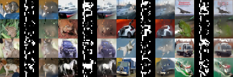
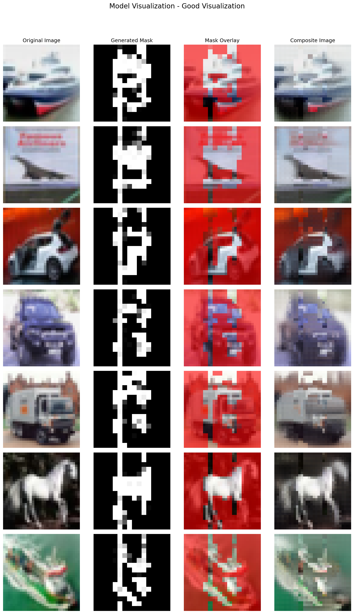
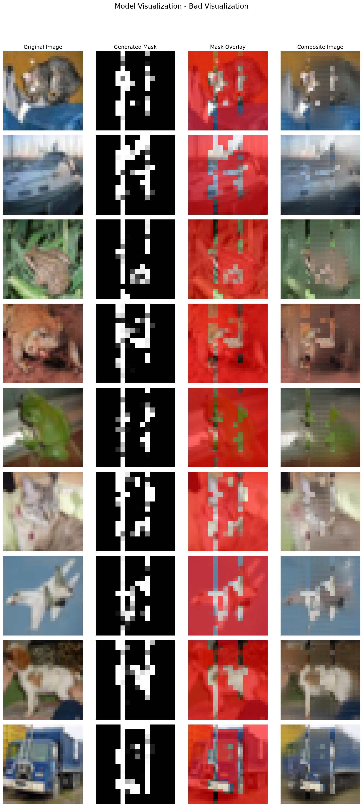

# masking-transformer

## Intro

Unsupervised content-adaptive patch selection for Masked Autoencoder (MAE) reconstruction — a model learns which image regions matter most for reconstruction, with the decoder filling in the rest.

This was a small toy project I worked on during late 2024 that I haven't gotten around to extending yet, but plan to do it soon.



## Motivation

Reading the original MAE paper, I wondered if, we could use the decoder's knowledge of image structure to adaptively select patches to transmit after the pretraining process. Instead of randomly masking patches, we could learn to prioritize only the important regions, allowing the decoder to reconstruct the full image while communicating fewer patches.

Thus, **the goal of the project is to learn a masking policy over image patches that maximizes reconstruction quality, using a pretrained MAE decoder to fill in the missing patches.**

## Overview

At a high level, I leverage a pretrained MAE with frozen weights, combined with a lightweight (1M trainable parameters) patch selection network, to learn which patches to keep for reconstruction. The patch selection network predicts importance scores between 0 and 1 for each image patch. I then use the MAE's encoder (without the random masking step) to encode the selected patches into feature embeddings. 

The importance scores of the patch selection network are used by linearly interpolating each patch embedding with the learned mask token embedding from the MAE decoder, weighted by the predicted importance score. The MAE decoder then reconstructs the full image from these modified embeddings.

In summary:

The masker performs
```
Image → Masker → Calculate Patch Scores
```

then
```
Image -> MAE Encoder -> Assign patches to features/masks with Patch Scores → MAE Decoder → Reconstructed Image
```

The entire process is unsupervised and relies on the pretrained MAE for supervision.

## Implementation
This implementation is based on PyTorch and uses Lightning for training. I usually write custom training loops, but for this project I found Lightning CLI made it a lot easier to manage configurations and training.

The MAEs used were pretrained from scratch since I couldn't find any publicly available pretrained weights that matched the architecture I wanted to use. I used the referenced implementations below to create the models from scratch. I ended up reimplementing the relevant functions from the timm library into my own codebase to avoid installing the entire library and potentially running into version conflicts in the future.

I tried my best to be consistent with the original MAE implementation (weight initialization, 2d sinusoidal position embeddings, etc.), but there may be some differences in hyperparameters or training details.

Note that a caveat of this implementation is that it requires the embedding dimensions of the MAE encoder and decoder to be the same, since we are linearly interpolating between the patch embeddings and the mask token embeddings. This does diverge from the original MAE architecture where the decoder is typically narrower than the encoder.

### Formalism

Let $`x \in \mathbb{R}^{H \times W \times C}`$ be a single image, and let $`m_{\theta}: x \rightarrow \mathbb{R}^{L \times 1}`$ be the patch selection network parameterized by $\theta$, where each score $\left(m_{\theta}(x)\right)_i \in [0, 1]$ corresponds to the importance of a patch in the image. Here, $L$ is the total number of patches in the image.

Let $E_{mae}(x) \in \mathbb{R}^{L \times D}$ be the patch embeddings produced by the MAE encoder, and let $t_{mae} \in \mathbb{R}^{1 \times D}$ be the learned mask token embedding from the MAE decoder.

The modified patch embeddings $E_{mod} \in \mathbb{R}^{L \times D}$ are computed either as a linear interpolation between the features and mask tokens, or sampled using the Gumbel Softmax. For the case of the linear interpolation, we have:
$$E_{mod} = m_{\theta}(x) \odot E_{mae}(x) + (1 - m_{\theta}(x)) \odot t_{mae}$$

The MAE decoder $D_{mae}$ then reconstructs the full image $\hat{x} \in \mathbb{R}^{H \times W \times C}$ from the modified embeddings:
$$\hat{x} = D_{mae}(E_{mod})$$

### Loss Function

We aim to jointly optimize three objectives:
1. **Composite MSE Loss**: Mean Squared Error between the original image and a composite image that simulates what the receiver would actually perceive. The composite combines transmitted regions (using original pixels where $m_{\theta}(x)$ is high) with masked regions (using decoder reconstructions where $m_{\theta}(x)$ is low).
2. **Sparsity Regularization**: Encourage the patch selection network to transmit fewer patches by penalizing the squared mean of mask probabilities.
3. **Entropy Regularization**: Encourage confident binary decisions (probabilities close to 0 or 1) by penalizing the entropy of mask probabilities.

The total loss $L$ is a weighted sum of these components:
$$L = L_{composite} + \lambda_{mean} L_{sparsity} + \lambda_{ent} L_{entropy}$$

where $\lambda_{mean}$ and $\lambda_{ent}$ are hyperparameters that balance the contributions of each regularization term.

#### Composite Image Construction

First, the mask probabilities are upsampled from patch resolution $(L)$ to full pixel resolution $(H \times W)$ using nearest-neighbor interpolation:
$$M_{spatial} = \text{Upsample}(m_{\theta}(x)) \in \mathbb{R}^{H \times W \times C}$$

The composite image $x_{comp}$ represents what the receiver (the decoder) perceives:
$$x_{comp} = M_{spatial} \odot x + (1 - M_{spatial}) \odot \hat{x}$$

where $\odot$ denotes element-wise multiplication. High $M_{spatial}$ values (transmitted regions) use original pixels, while low values (masked regions) rely on the decoder's reconstruction.

#### Loss Components

**Composite MSE Loss:**
$$L_{composite} = \frac{1}{N \cdot H \cdot W \cdot C} \sum_{i=1}^{N} ||x_i - x_{comp,i}||^2$$

**Sparsity Regularization:**
$$L_{sparsity} = \left( \frac{1}{N \cdot L} \sum_{i=1}^{N} \sum_{j=1}^{L} m_{\theta}(x_i)_j \right)^2$$

Note that the mean is squared, I empirically found that this improved training, I suspect this provides a smoother gradient than a linear penalty.

**Entropy Regularization:**
$$L_{entropy} = \frac{1}{N \cdot L} \sum_{i=1}^{N} \sum_{j=1}^{L} H(m_{\theta}(x_i)_j)$$

where the binary entropy is:
$$H(p) = -p\log(p + \epsilon) - (1-p)\log(1-p + \epsilon)$$

with $\epsilon$ as a small constant for numerical stability (default: $10^{-6}$).

#### Current Hyperparameters (CIFAR-10)

Based on `configs/masker_config_cifar10.yaml`:
- $\lambda_{mean}$ = 0.2 (mean_reg)
- $\lambda_{ent}$ = $10^{-6}$ (entropy_reg)
- Learning rate: 1.5e-4
- Weight decay: 0.05
- Image size: 32×32
- Patch size: 2×2 (256 patches per image)
- Embedding dimension: 192

### Training Details

The model uses **Gumbel-Softmax reparameterization** during training to maintain differentiability while encouraging discrete decisions. The temperature $\tau$ is annealed from 1.0 to 0.5 over the first 2000 training steps using cosine annealing:

$$\tau(t) = \begin{cases}
1.0 & \text{if } t < t_{start} \\
0.5 & \text{if } t \geq t_{end} \\
0.25 \cdot (1.0 - 0.5) \cdot \cos\left(\pi \cdot \frac{t - t_{start}}{t_{end} - t_{start}}\right) + 0.75 & \text{otherwise}
\end{cases}$$

where $t_{start}$ = 0 and $t_{end}$ = 2000.

## Results

Overall, the **masker learns to keep only about 15.7% of the image patches**. Compared to the 25% of random image patches that the MAE keeps during pretraining on random masks.

The model tends to do well on some types of images compared to others. Below are some examples where the model performs well and provides pretty good saliency masks of the images.


Below are some examples where it is not necessarily the case.



## Training

### Setup

This project was developed using Python 3.13.9. 

Install the required dependencies:
```bash
pip install -r requirements.txt
```

The project uses PyTorch Lightning with the LightningCLI interface.

### Training Command

To train the masking model on CIFAR-10:
```bash
python train.py fit --config configs/masker_config_cifar10.yaml
```

### Configuration

All training hyperparameters are defined in YAML config files. Key configuration files:

- `configs/masker_config_cifar10.yaml` - Main masking model training config
- `configs/mae_config_cifar10.yaml` - MAE pretraining config

You can override any config parameter from the command line:
```bash
# Override learning rate and batch size
python train.py fit --config configs/masker_config_cifar10.yaml \
    --model.init_args.lr=3e-4 \
    --data.init_args.batch_size=256
```

### Pretraining MAE (Optional)

```bash
python train.py fit --config configs/mae_config_cifar10.yaml
```

The Model Checkpoint callback is not included by default in the YAML, but can be added pretty easily under the callbacks field.

Note: The masking model config references a pretrained MAE checkpoint path. The provided weights are in the `weights` directory.

## ✅ TODO / Roadmap

- [ ] Get results for STL10 dataset (pretraining MAE on STL10 hasn't been trivial)
- [ ] Experiment with CNN based patch selection network

### References & Credits

This project builds on prior work on Masked Autoencoders (MAE) and related open-source implementations.

#### Masked Autoencoders
**Masked Autoencoders Are Scalable Vision Learners**  
Kaiming He, Xinlei Chen, Saining Xie, et al. (Meta AI, 2021)  
📄 Paper: https://arxiv.org/abs/2111.06377  
💻 Official Code: https://github.com/facebookresearch/mae

#### Community Implementation Reference
Part of this implementation was inspired by the following repository:  
- https://github.com/IcarusWizard/MAE.git *Xingyuan Zhang*

- https://github.com/huggingface/pytorch-image-models *timm library*

#### Gumbel-Softmax for Binary Variables
**Gumbel-Softmax for the Binary Case**  
J. Zin (Technical Note)  
📄 Document: https://j-zin.github.io/files/Gumbel_Softmax_for_Binary_Case.pdf

This technical note provided the implementation details for applying Gumbel-Softmax reparameterization to binary masking decisions.

<details>
<summary>BibTeX</summary>

```bibtex
@article{he2021mae,
  title={Masked Autoencoders Are Scalable Vision Learners},
  author={He, Kaiming and Chen, Xinlei and Xie, Saining and et al.},
  journal={arXiv preprint arXiv:2111.06377},
  year={2021}
}

@misc{rw2019timm,
  author = {Ross Wightman},
  title = {PyTorch Image Models},
  year = {2019},
  publisher = {GitHub},
  journal = {GitHub repository},
  doi = {10.5281/zenodo.4414861},
  howpublished = {\url{https://github.com/rwightman/pytorch-image-models}}
}
@misc{zin_gumbel_binary,
  author = {Zin, J.},
  title = {Gumbel-Softmax for the Binary Case},
  howpublished = {\url{https://j-zin.github.io/files/Gumbel_Softmax_for_Binary_Case.pdf}},
  note = {Technical Note},
  year = {2024}  % or appropriate year if known
}
```
</details>
